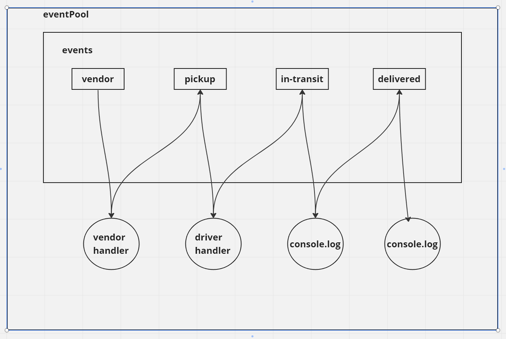
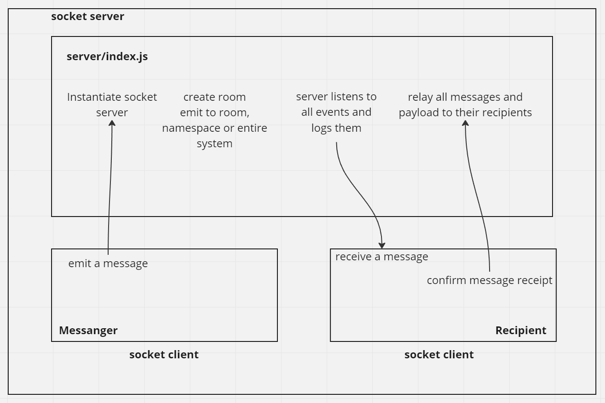
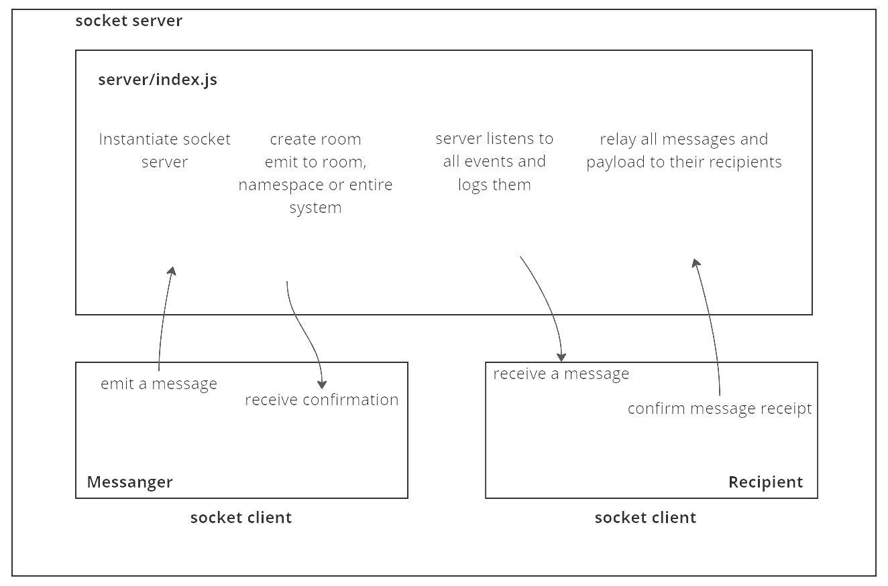

# LAB - Class 11

## Project: CAPS - Code Academy Parcel Service

## Author: Steve Gant (collaborated with Joe and Jordan)

## Problem Domain
### Phase 1 Requirements
Today, we begin the first of a 4-Phase build of the CAPS system, written in Node.js. In this first phase, our goal is to setup a pool of events and handler functions, with the intent being to refactor parts of the system throughout the week, but keep the handlers themselves largely the same. The task of “delivering a package” doesn’t change (the handler), even if the mechanism for triggering that task (the event) does.

The following user/developer stories detail the major functionality for this phase of the project.

- As a vendor, I want to alert the system when I have a package to be picked up.
- As a driver, I want to be notified when there is a package to be delivered.
- As a driver, I want to alert the system when I have picked up a package and it is in transit.
- As a driver, I want to alert the system when a package has been delivered.
- As a vendor, I want to be notified when my package has been delivered.

And as developers, here are some of the development stories that are relevant to the above.

- As a developer, I want to use industry standards for managing the state of each package.
- As a developer, I want to create an event driven system so that I can write code that happens in response to events, in real time.

### Phase 2 Requirements
In Phase 2, we’ll be changing the underlying networking implementation of our CAPS system from using node events to using a library called Socket.io so that clients can communicate over a network. Socket.io manages the connection pool for us, making broadcasting much easier to operate, and works well both on the terminal (between servers) and with web clients.

The core functionality we’ve already built remains the same. The difference in this phase is that we’ll be creating a networking layer. As such, the user stories that speak to application functionality remain unchanged, but our developer story changes to reflect the work needed for refactoring.

  - As a vendor, I want to alert the system when I have a package to be picked up.
  - As a driver, I want to be notified when there is a package to be delivered.
  - As a driver, I want to alert the system when I have picked up a package and it is in transit.
  - As a driver, I want to alert the system when a package has been delivered.
  - As a vendor, I want to be notified when my package has been delivered.

And as developers, here is our updated story relevant to the above.

  - As a developer, I want to create network event driven system using Socket.io so that I can write code that responds to events originating from both servers and client applications

## Phase 3 Requirements
In Phase 3, we are building a set of features to help manage deliveries made by CAPS Drivers. This will simulate a delivery driver receiving a list of orders from a Queue and “scanning” package codes on delivery. Retailers will be able to see in their dashboard or log, a list of all packages delivered in real time. Should a delivery driver deliver many packages while the retailer is not connected to the dashboard, the vendor client should be guaranteed to receive “delivery” notifications from the Queue system.

Here are the high level stories related to this new set of requirements.

  - As a vendor, I want to “subscribe” to “delivered” notifications so that I know when my packages are delivered.
  - As a vendor, I want to “catch up” on any “delivered” notifications that I might have missed so that I can see a complete log.
  - As a driver, I want to “subscribe” to “pickup” notifications so that I know what packages to deliver.
As a driver, I want to “catch up” on any “pickup” notifications I may have missed so that I can deliver everything.
As a driver, I want a way to “scan” a delivery so that the vendors know when a package has been delivered.
And as developers, here are some of the development stories that are newly relevant to the above.

As a developer, I want to create a system of tracking who is subscribing to each event.
As a developer, I want to place all inbound messages into a “queue” so that my application knows what events are to be delivered.
As a developer, I want to create a system for communicating when events have been delivered and received by subscribers.
As a developer, I want to delete messages from the queue after they’ve been received by a subscriber, so that I don’t re-send them.
As a developer, I want to create a system for allowing subscribers to retrieve all undelivered messages in their queue.

## Links and Resources
  - [GitHub Actions ci/cd](https://github.com/stevengant/CAPS/actions)

## Setup
.env requirements (where applicable)
PORT=3001

How to initialize/run your application (where applicable)
  - nodemon

How to use your library (where applicable)

Features / Routes
  - Feature One: Details of feature
  - GET : /person - specific route to hit

Tests
  - How do you run tests?
  - Any tests of note?
  - Describe any tests that you did not complete, skipped, etc

## UML

